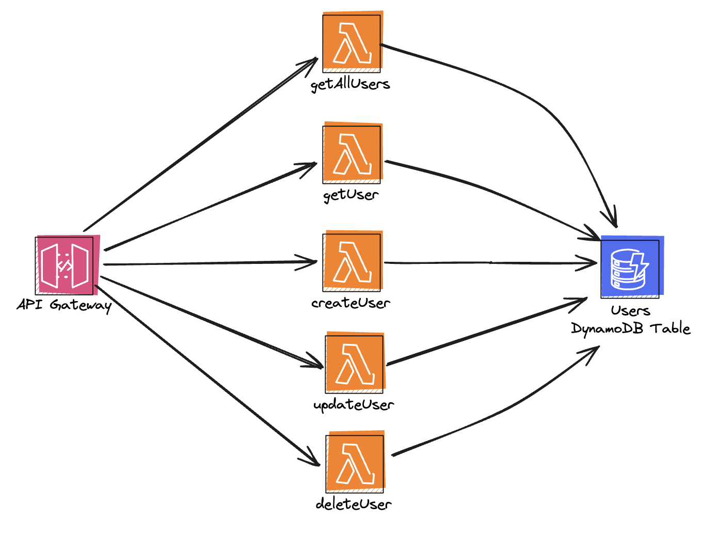
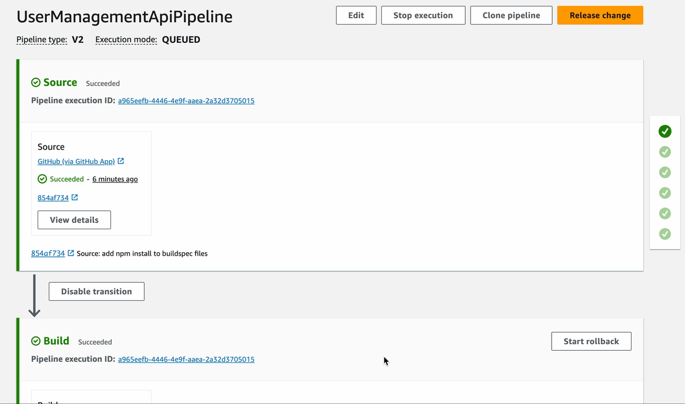

# Serverless Framework v4 example REST API

This project illustrates a small CRUD REST API for user management, built and deployed with Serverless Framework v4.

## Usage

### Deployment

In order to deploy the example, you need to run the following command:

```
serverless deploy --stage dev
```

### Invocation

After successful deployment, the API can be called via HTTP endpoints that look something like `https://xxxxxxx.execute-api.region.amazonaws.com/`.

### Available endpoints

* `GET /users`
* `GET /users/{id}`
* `POST /users`
* `PUT /users/{id}`
* `DELETE /users/{id}`

#### Model

User model is defined by an `id` and several other fields, for example:

```json
{
  "id": "b43ce652-0c65-462d-ad6f-87db9798d869",
  "name": "John Doe",
  "email": "john@example.com",
  "age": 35
}
```

### Architecture



## CI/CD

CI/CD is implemented using AWS CodePipeline with the following stages:
* Build - performs the build of the app
* Test - runs unit tests
* DeployDev - performs serverless deployment to "dev" stage
* ProdApproval - manual approval step to decide promoting the changes to "prod" stage
* DeployProd - performs serverless deployment to "prod" stage

